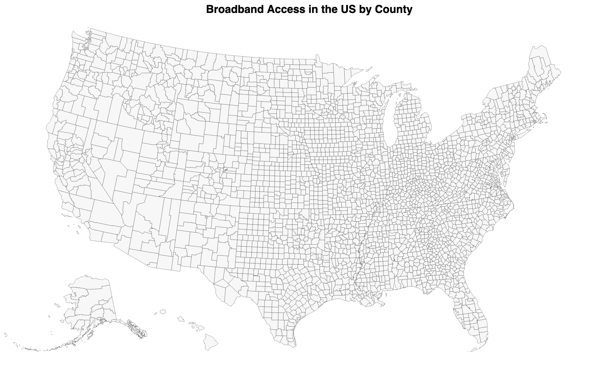

# Choropleth Map of Broadband Access in the US

#### This dataset on United States broadband bsage percentages was obtained from :
https://github.com/microsoft/USBroadbandUsagePercentages
____

___

### The graph:

This map was created with D3. My goal was to create a choropleth map using a color scale to represent percentages of households with broadband access by county in the US. As of now, I have not been successful at getting the color fill to work in my code.

