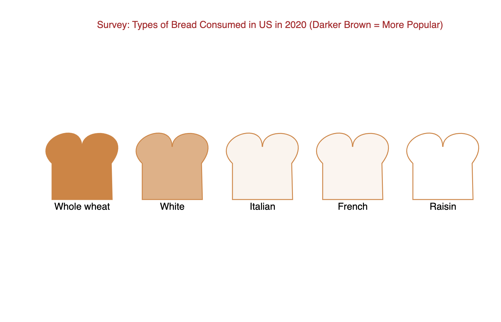

# Bread Consumption in US by Type 2020

#### This data was sourced from Statista: https://www-statista-com.ezproxy.pratt.edu/statistics/279981/us-households-types-of-bread-consumed/
____

## Dataset description (from Statista):  
This statistic shows the types of bread eaten most often in the United States in 2020. The data has been calculated by Statista based on the U.S. Census data and Simmons National Consumer Survey (NHCS). According to this statistic, 192.68 million Americans consumed whole wheat/ multi-grain bread in 2020.  
___

## Visualizing the Bread Dataset with D3 and SVG

The visualization displays bread types from most popular (darkest) to least popular (lightest).
___
