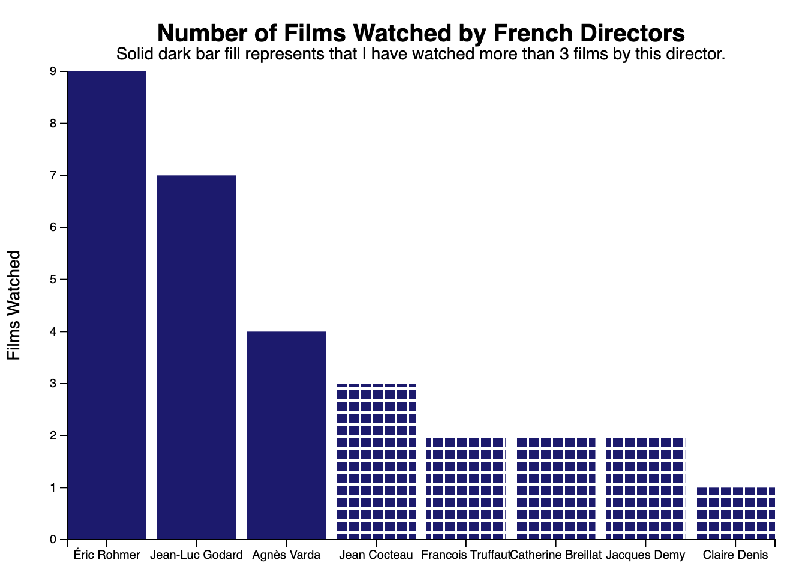
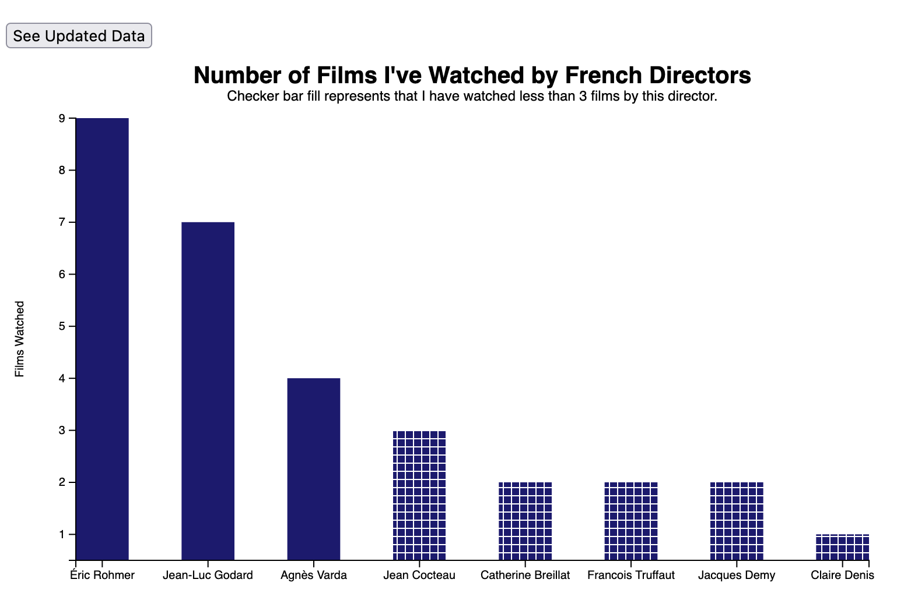
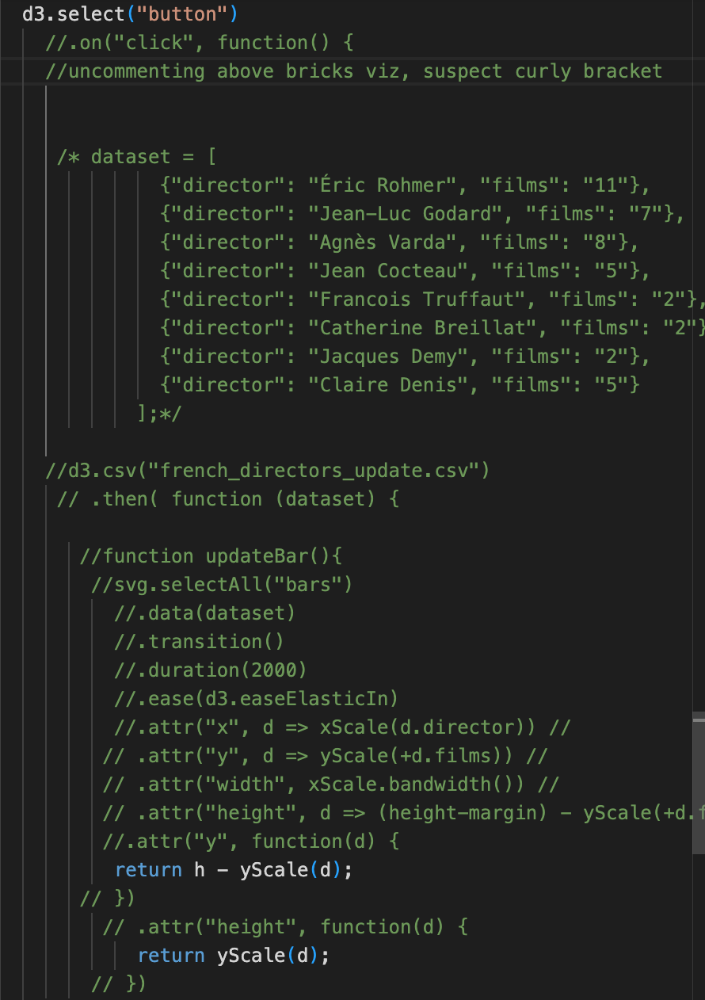

# Adding Interactivity to Film Directors Bar Chart

### I previously created this dataset based on a list I made of French films I have seen by notable directors. I created an updated dataset with the numbers of films watched by certain directors increased for the purpose of this assignment.
____

___

## The original bar chart:

The visualization displays a solid bar for directors of who I've seen more than 3 films by. The checkered bars represent directors I've seen 3 or less films by.
___

## The new bar chart:

I will start with the caveat that I was not able to get this to work (despite hours and hours of trying!). My intention was to add a button to this visualization that would update the data to show that some values have increased and some remain the same. I was able to get the button to appear but it does not generate an updated chart with a click. Here is a sample of my code, which is commented out:

Something is off with my code in either or both of the event listener and updated data. I had a lot of trouble looking for examples of code to reference online that were in the current version of d3. I also tried adding a sort function but ran into a similar issue. I'll keep trying.