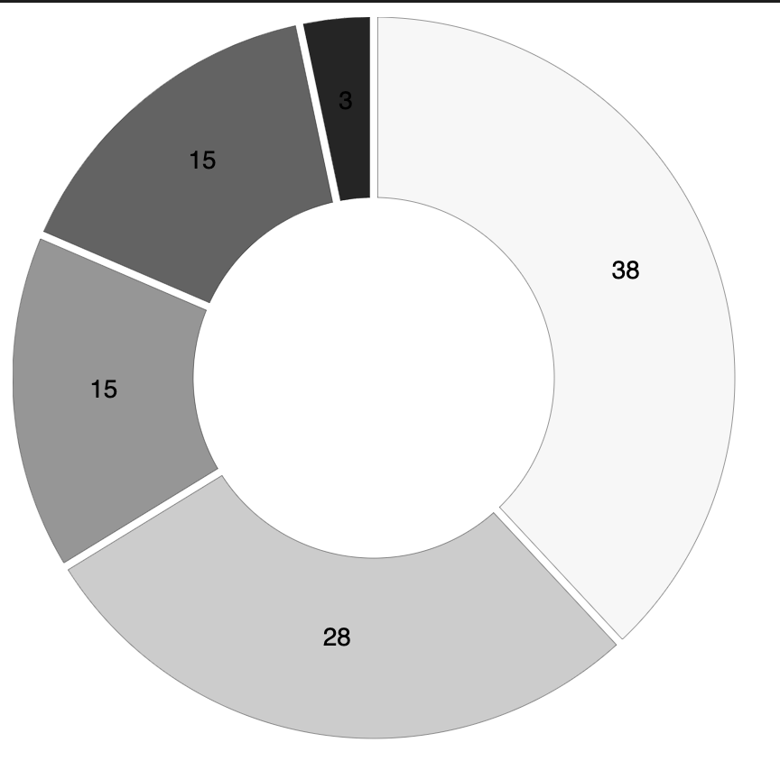

# Donut Chart of 2022 Rat Sightings by NYC Borough 

#### This dataset was obtained from NYC Open Data using a dataset of 311 complaints filtered by year (2022) and complaint type (rat sighting).
____

___

### The donut chart:

The visualization displays a solid bar for directors of who I've seen more than 3 films by. The checkered bars represent directors I've seen 3 or less films by.
___
